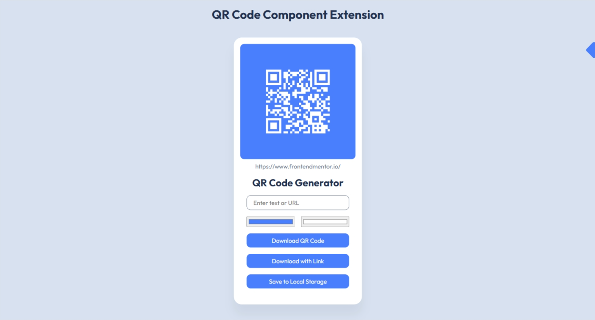

# QR Code Component Extension - QR Code Generator
This is the React extension of the [QR Code Component](https://www.frontendmentor.io/solutions/qr-code-component-xixkp7hzyW) challenge on [Frontend Mentor](https://www.frontendmentor.io/challenges/qr-code-component-iux_sIO_H). I designed it to be look similar to the original project but with extra features to make it more interactive.

## Overview
Unlike the base project that it simply a card advertising Frontend Mentor with a QR Code, the user can now generate and download their own QR codes. The QR code is automatically updated as the user fills in the text box, and what they type is copied below the QR code for reference. The user can change the foreground and background with the color inputs below the text box. The user can download just the QR code with the surrounding box, or they can also include the reference link. By default, the QR code has a white foreground, a blue background, and `https://www.frontendmentor.io/` (the link from the challenge) as the value.

## Author
- GitHub Profile: [PresidentTree94](https://github.com/PresidentTree94)
- Frontend Mentor Profile: [PresidentTree94](https://www.frontendmentor.io/profile/PresidentTree94)
- Author Website: [PresidentTree94 Portfolio](https://presidenttree94.github.io/project-portfolio/)